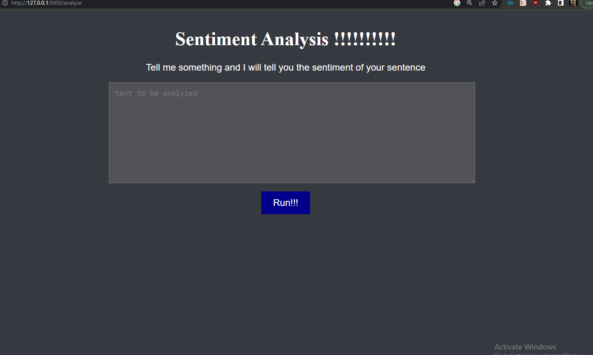

# Python test/ backend developer 
### Project overview

I have made a service  that exposes a RESTful API endpoint for sentiment analysis. This API accepts text input and returns the sentiment analysis result using a pre-trained machine learning model.

I have implimented the webserver using python Flask because of it's versatility and lightweight nature 

On the `analyze`  endpoint it accepts a `POST` method.  It contains a JSON object on 
`data = request.get_json()`. The recieved structure is as the following

    
    {
    "text": "Text to be analyzed"
    }

Now it's passed on the `sentiment_analysis ()` function to do a sentiment analysis classification. 
in this `sentiment_analysis ()`  I have used `distilbert-base-uncased` from [HuggingFace](https://huggingface.co/ "HuggingFace")

After analysis this API returns a JSON response as the following 

    {
    "sentiment": "positive/negative/neutral"
    }
To test our API,  I have also included a `test.py` file with the project 
### prerequisite 

 - python 3
 - pip 

### Project Setup
Clone the repository to your local machine using the following command:

    git clone https://github.com/LabibAhmedSiddique/Sentiment-analysis-API.git
Change to the project directory using the following command 

    cd Sentiment-analysis-API

create a python virtual environment 

     python -m venv eval_test

Now activate the virtual environment with the following command 


    eval_test/Scripts/activate
after you activate the virtual environment run the `requirements.txt` file to install all the dependencies 
### Run the project
Now inside terminal run the `app.py` file using the following command


    python app.py
The flask server will start  and the terminal should have the following output 


```bash
    (eval_test) E:\Sentiment-project>python app.py
     * Serving Flask app 'app'
     * Debug mode: on
    WARNING: This is a development server. Do not use it in a production deployment. Use a production WSGI server instead.
     * Running on http://127.0.0.1:5000
    Press CTRL+C to quit
     * Restarting with stat
     * Debugger is active!
     * Debugger PIN: 382-522-973
```

Now the app is set up and running 
### Getting outputs
you can do sentiment analysis and check the sentiment of the sentence in two ways 
#### First method: Using test.py


open the `test.py`  in your desired text editor.  In that file you will see the `payload` variable


    payload = {
        "text": "its a good day for me"    
    }
use any text you want to do a sentiment analysis on the dictionary.  I have used "Its a good day for me "


open another terminal on the project directory and activate the virtual environment using the previous steps. 
Now run `test.py` using the following command 
python app.py

    python test.py

this test.py is used to send a `POST` request to the specified URL with the provided JSON payload.
the output should be the following for the given example 
```bash
{
  "sentiment": "positive"
}
```
#### Second method: using the web browser 
after running the `app.py` the flask server will start. after starting paste the following URL in your web browser 


    http://127.0.0.1:5000/analyze
	

write your sentence on the form and hit run!!!
